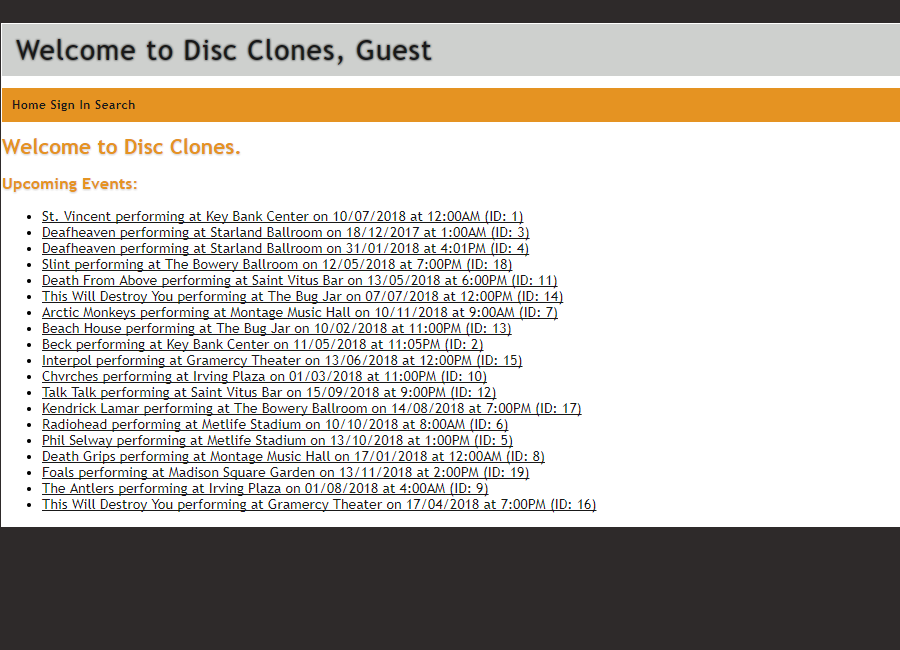

## About Me

Hi, my name is Trevor Davies. I am currently finishing my Computer Science B.S. at Rochester Institute of Technology. I'm anticipating finishing my coursework in December 2019!

I became interested in programming at a very young age. When I was a child I would tinker around with my families old Windows 98 machine. I taught myself the basics of Visual Basic .NET my freshman year of high school. In college I mainly work with Java, Python, C# and C.

In my free time I enjoy listening to music and Esports. In spring 2019 I was a player on RIT's Competitive Call of Duty Esports team. At the end of the season I stepped down as a player and I am currently the assistant manager/coach for the team.

## Portfolio


[TournaLink](https://tournalink.com) allows you to create a password protected golf tournament. Participants can then join the tournament and update their scorecard while they play. This means you can view live standings straight from the course! No more waiting to turn the scorecard in to know how others did.


This was a group project for my CSCI-320 (Principles of Database Management) class. We created a [Discogs](https://discogs.com) clone. While it doesn't contain all the functionality of the Discogs website the main idea is still there. For the project we used Java for the backend, and Spark and Freemarker for the web framework. You can view the report and code (here)[https://github.com/trevordavies095/Discogs-Clone].

[!NightStand](portfolio/nightstand.png)
Pebble is a smart watch which is famous for it's Kickstarter beginning. I wanted something clean and simple, nothing flashy. I also wanted to be able to use my watch as a clock next to my bed. This watchface leaves the backlight on when charging so you can easily view it on your night stand! You can view the code (here)[https://github.com/trevordavies095/NightStand]

You can view more of my code on my (GitHub)[https://github.com/trevordavies095]!


Markdown is a lightweight and easy-to-use syntax for styling your writing. It includes conventions for

```markdown
Syntax highlighted code block

# Header 1
## Header 2
### Header 3

- Bulleted
- List

1. Numbered
2. List

**Bold** and _Italic_ and `Code` text

[Link](url) and 
```

For more details see [GitHub Flavored Markdown](https://guides.github.com/features/mastering-markdown/).

### Jekyll Themes

Your Pages site will use the layout and styles from the Jekyll theme you have selected in your [repository settings](https://github.com/trevordavies095/trevordavies095/settings). The name of this theme is saved in the Jekyll `_config.yml` configuration file.

### Support or Contact

Having trouble with Pages? Check out our [documentation](https://help.github.com/categories/github-pages-basics/) or [contact support](https://github.com/contact) and we’ll help you sort it out.
